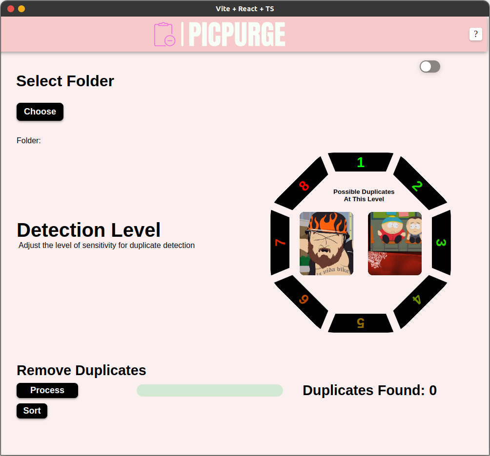

<div style="text-align:center">
  
</div>

A Python script that facilitates the identification and removal of duplicate images within a designated directory, as well as image sorting using Machine Learning. This script utilizes image hashing for comparison purposes and now incorporates sorting functionality using TensorFlow for enhanced efficiency. The script offers both a command-line interface and a user-friendly GUI for seamless utilization.
## GUI Usage

1. **Choose Folder**: Click the "Browse" button to select the target folder containing the images.
2. **Duplicate Detection Level**: Utilize the Detection Level slider to fine-tune the sensitivity of the duplicate detection mechanism.
3. **Keep Non-Media Files**: Check this option to retain non-media files while the process is underway.
4. **Initiate Processing**: Click the "Process" button to initiate the procedure for detecting and eliminating duplicate images.
5. **Start Sorting**: Click the "Sort" button to begin sorting all images into automatically generated categories.

## Installation and Setup

1. Clone the repository or download the script to your local machine.
2. Install the necessary Python libraries using the subsequent command:

```sh
pip install Flask imagehash tensorflow tqdm
```

3. Execute the script by utilizing the command line or by launching the graphical user interface (GUI).

## How It Works

- The script leverages image hashing to facilitate image comparison, and now employs TensorFlow for efficient sorting, thereby enhancing the identification of duplicate images based on the designated threshold (agro_threshold).
- Duplicate images are systematically organized into a "Duplicate-Images" subfolder within the original directory.
- Images with file extensions such as `.jpg`, `.jpeg`, `.png`, `.gif`, `.bmp`, `.mp4`, `.avi`, `.mkv`, and `.mov` are eligible for comparison. The option to eliminate non-media files is accessible through the "Retain Non-Media Files" checkbox.

We welcome your valuable feedback and encourage you to report any encountered issues for further refinement.
